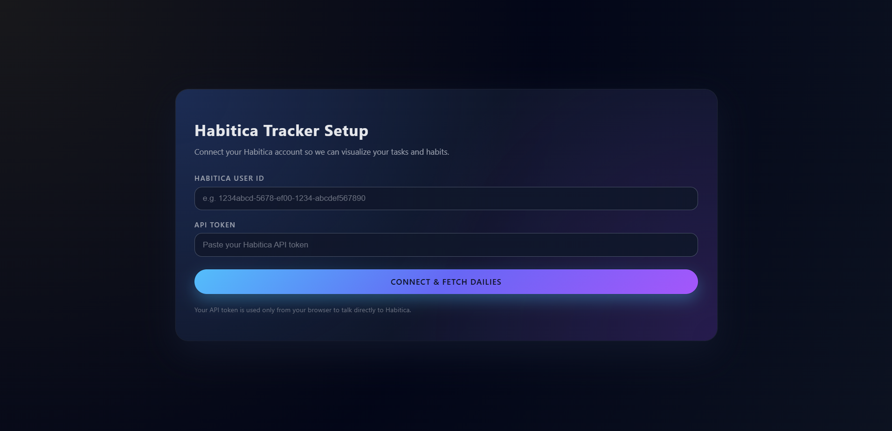
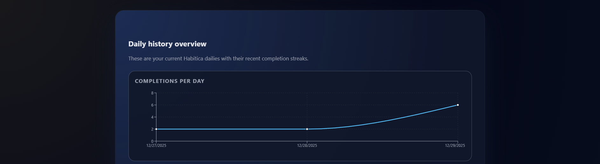
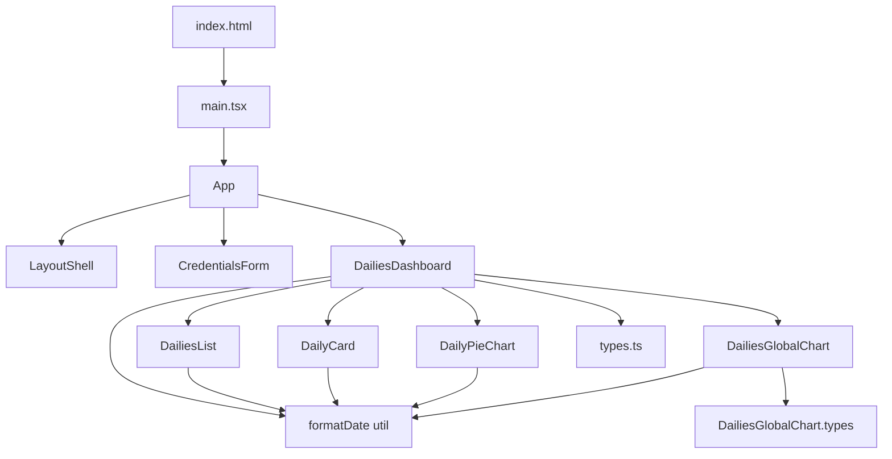

## Habitica Tracker

Habitica Tracker is a small React + TypeScript app that helps you visualize and track your Habitica **Dailies** outside the main Habitica UI.

<p align="center">
  
</p>

<p align="center">
  
</p>

<p align="center">
  
</p>

It focuses on answering questions like:

- How many dailies do I have across different categories?
- Which ones are currently active vs. completed?
- How does my daily load look over time?

The app is built with Vite for a fast development experience and uses a small, focused set of reusable components for dashboards and charts.

> Note: This project is a personal utility / learning project and is not an official Habitica product.

---

## Usage

### 1. Prerequisites

- Node.js (LTS version recommended)
- pnpm / npm / yarn (examples below use `npm`)
- A Habitica account and API credentials (User ID and API Token)

### 2. Install dependencies

From the project root:

```powershell
npm install
```

### 3. Start the dev server

```powershell
npm run dev
```

Then open the URL shown in the terminal (usually `http://localhost:5173`).

### 4. Provide Habitica credentials

On first load, you’ll see the **Credentials Form**:

1. Enter your Habitica **User ID**.
2. Enter your **API Token**.
3. Submit to fetch your Dailies data.

Your credentials are used only from the browser to query Habitica’s API. For security, do **not** commit them to version control or hard‑code them in the repo.

### 5. Explore the Dailies views

Once data is loaded, you can explore:

- **Dailies Dashboard** – High-level overview of your Dailies, counts, and quick stats.
- **Dailies List** – A list view of all Dailies with their status and key metadata.
- **Daily Card** – A focused card-style representation of a single daily.
- **Daily Pie / Global Charts** – Visual breakdowns (e.g., by completion, difficulty, or tag/category).

### 6. Build for production

```powershell
npm run build
```

This outputs a production build into the `dist` folder, ready to be deployed to any static hosting provider.

To preview the production build locally:

```powershell
npm run preview
```

---

## Architecture

### Tech stack

- **Framework**: React + TypeScript
- **Bundler/Dev server**: Vite
- **Styling**: `App.css` / `index.css` (standard CSS modules for layout + theming)
- **Charts**: Custom, component-based charts (no heavy charting framework by default)
- **API integration**: Habitica HTTP API, accessed via browser fetch calls

### High-level structure

Project layout (simplified):

- `src/main.tsx` – React entry point, renders `App` into the DOM.
- `src/App.tsx` – Top-level composition of layout + pages.
- `src/components/LayoutShell.tsx` – Shared layout shell (header, main content area, basic navigation if any).
- `src/components/CredentialsForm.tsx` – Collects and validates Habitica credentials, kicks off data fetch.
- `src/components/DailiesDashboard.tsx` – Orchestrates the dailies views and aggregates data.
- `src/components/DailiesList.tsx` – Renders list of dailies.
- `src/components/DailyCard.tsx` – Presentational component for a single daily.
- `src/components/DailyPieChart.tsx` – Pie chart for daily breakdowns.
- `src/components/DailiesGlobalChart.tsx` – Global chart(s) for a holistic view of all dailies.
- `src/components/DailiesGlobalChart.types.ts` – Type definitions for chart props/data.
- `src/utils/formatDate.ts` – Utility to format Habitica dates for display.
- `src/types.ts` – Shared TypeScript types (e.g., Habitica Daily, API response shapes, etc.).

State and data generally live in `App`/`DailiesDashboard`, and are passed down via props to the presentational components (Cards, Lists, Charts).

### Component architecture (Mermaid)



Data flow (conceptually):

1. `CredentialsForm` collects credentials and triggers API calls.
2. Fetched Habitica Dailies are stored in a parent state (e.g., `App` or `DailiesDashboard`).
3. `DailiesDashboard` derives view models and metrics from raw data.
4. Presentation components (`DailiesList`, `DailyCard`, `DailyPieChart`, `DailiesGlobalChart`) receive already-shaped props and focus purely on rendering.

This keeps business logic close to the top of the tree and the leaf components highly reusable and easy to test.
